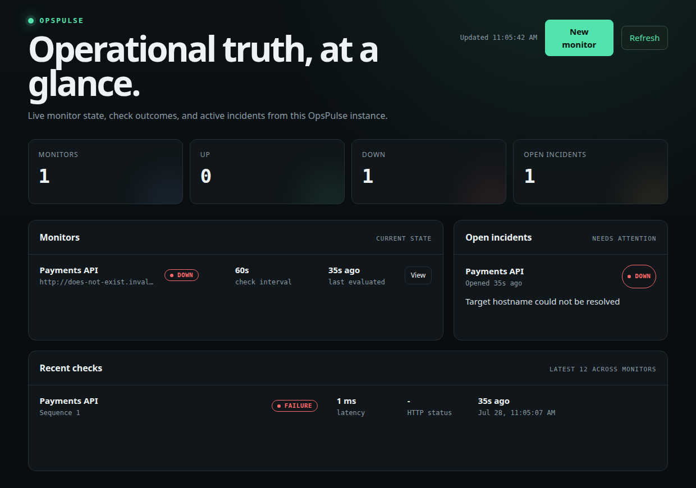
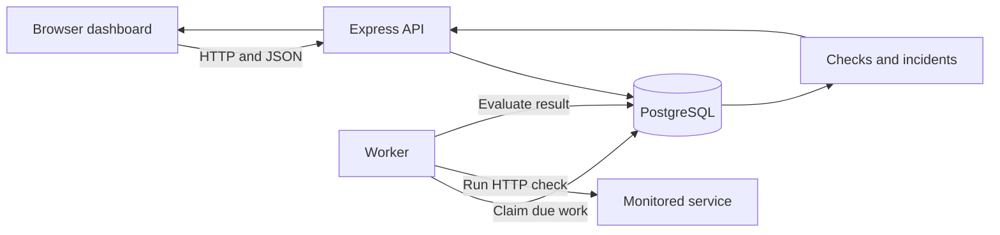
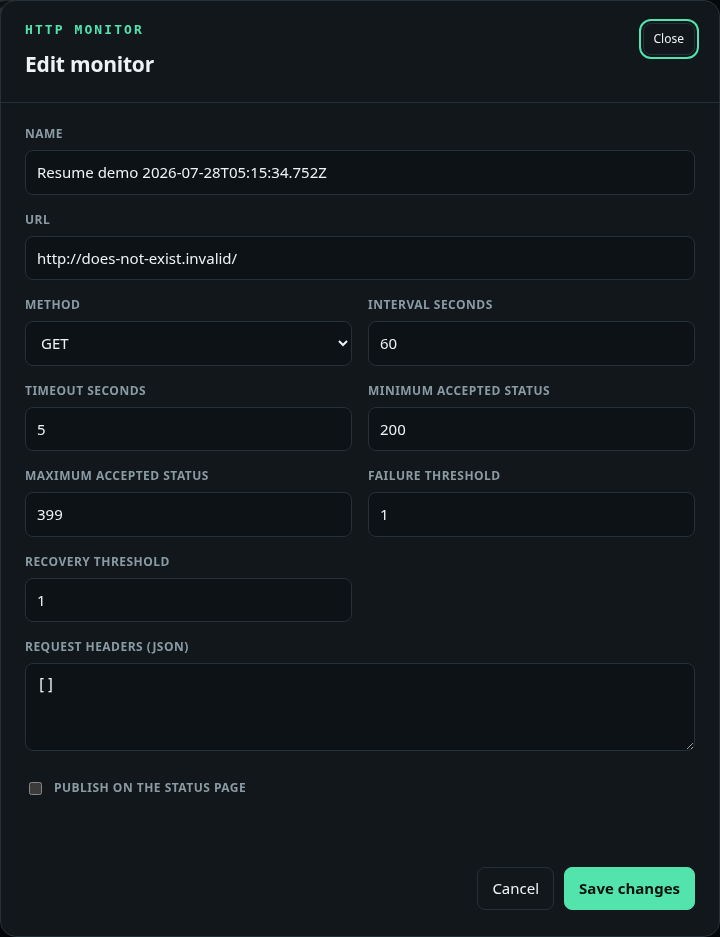
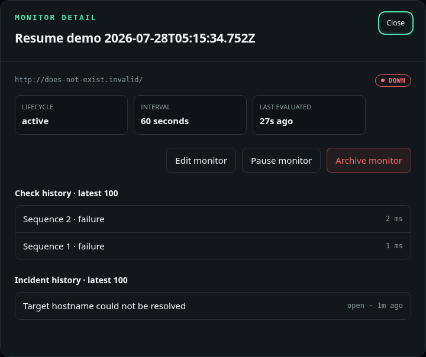

# OpsPulse

OpsPulse is a self-hosted HTTP monitoring demo that turns scheduled checks into durable incident state operators can inspect and act on.



## What OpsPulse Does

- Creates and edits HTTP monitors with configurable schedules, timeouts, methods, accepted status ranges, thresholds, and request headers.
- Runs checks in a separate worker and records latency, HTTP status, and stable failure classifications.
- Opens and resolves incidents from configurable consecutive-failure and recovery thresholds.
- Provides an operations dashboard and cursor-paginated JSON APIs for monitors, checks, and incidents.
- Supports monitor detail, pause, resume, archive, manual refresh, and automatic dashboard refresh.

## Architecture



The Compose stack runs PostgreSQL, a one-shot migration service, the Express API with its static dashboard, and one Node.js worker. PostgreSQL is both the system of record and the worker coordination mechanism.

## Reliability Engineering

- **Generation-safe edits:** schedule-affecting changes cancel pending work, increment the monitor generation, and reset sequencing so stale results cannot alter current state.
- **Monitor-first row locking:** lifecycle changes and check completion lock the monitor before pending check rows, giving concurrent transactions a consistent lock order.
- **Leases and reclamation:** workers claim checks transactionally with `SKIP LOCKED`; abandoned work becomes reclaimable after `2 * timeoutSeconds + 60s`.
- **Contiguous evaluation:** only the active generation's next sequence can advance counters or incident state.
- **SSRF defenses:** outbound targets are schema-checked, DNS resolution is bounded, non-public IPv4 and IPv6 ranges are rejected, and the request connects to the approved resolved address.
- **Archived history:** archiving cancels pending work and resolves an open incident while preserving check and incident records for history queries.

### Monitor configuration



### Check and incident history



## Quick Start

Prerequisites are Node.js 24.18.0, pnpm 10.30.3, and Docker Engine with Docker Compose. Run host-side Node commands through the checked-in Node 24 wrapper.

```sh
scripts/run-node24 pnpm install --frozen-lockfile
docker compose up -d --build --wait postgres migrate api worker
curl --fail --silent --show-error http://127.0.0.1:3000/health/live
```

Open [http://127.0.0.1:3000](http://127.0.0.1:3000).

Stop and remove containers while preserving PostgreSQL data:

```sh
docker compose down
```

Delete PostgreSQL data and smoke-test state when a clean reset is needed:

```sh
docker compose --profile demo --profile smoke down -v
```

## Demo

After the stack is running, execute the one-shot demo:

```sh
docker compose run --rm demo
```

It creates an HTTP monitor for a deliberately unresolvable host, waits for the worker to classify `dns/ENOTFOUND`, and prints a compact JSON result with the monitor, check, and incident IDs. Inspect the resulting state in the dashboard.

## Verification

The repository currently has 540 automated tests. Run the unit suite alone or the full build, lint, typecheck, and test gate:

```sh
scripts/run-node24 pnpm test:unit
scripts/run-node24 pnpm check
```

The Compose smoke test verifies a fresh vertical slice, then verifies the same persisted IDs after restarting the API and worker without replacing volumes:

```sh
docker compose run --rm smoke
docker compose restart api worker
docker compose run --rm -e VERIFY_EXISTING=1 smoke
```

## Current Scope

OpsPulse currently implements local HTTP monitoring only. Authentication, heartbeat monitoring, notifications, and public status pages are not implemented. The dashboard and API are unauthenticated, and Compose publishes the API only on host loopback; this repository is intended for local evaluation rather than production deployment. No license has been selected.
